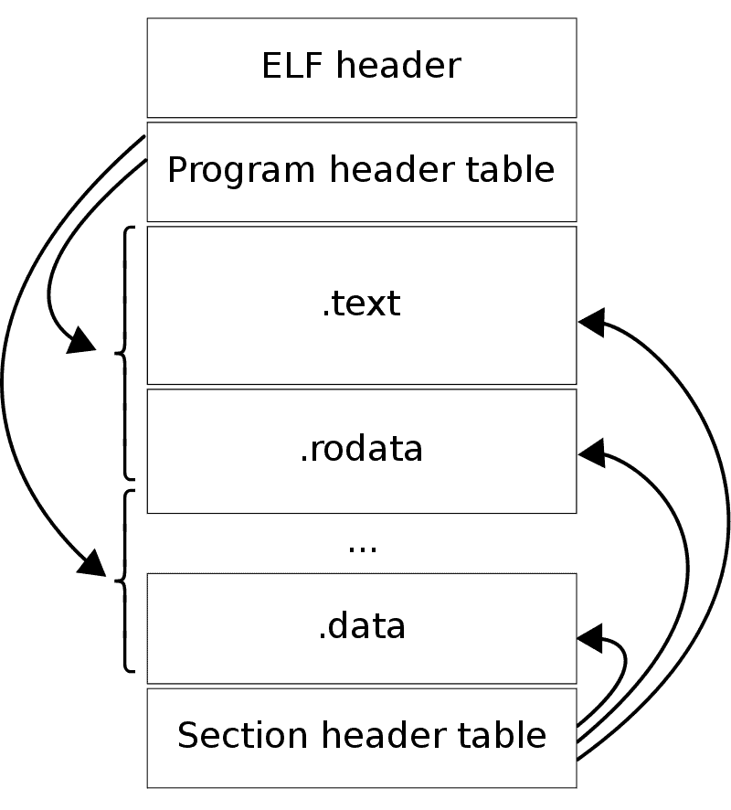

	

- Les fichier ELF (Executable Linkable File) sont un type de fichier binaire majoritairement utiliser sur Linux pour ses executables, objet partager (.so, dit plus simplement les libraire) et lse core dump
- Pour crée un fichier ELF, nous devons compiler notre code grace a un compilateur comme gcc/g++ ou clang/clang++ (pour le code en C/C++)

- La compilation des fichier C/C++ en ELF se fait majoritairement en 4 etapes : 
	1. [[Pre-processing]]
	2. [[Compiling]]
	3. [[Assembling]]
	4. [[Linking]]

- Les fichier ELF ont une structure tres specifique qui lui sert a etre identifier et parser assez facilement
- La structure des ELF en 32bit et 64bit sont tres similaire mais ont quelque difference
- Les fichiers ELF contiennent deux type de contenu:
	- Des instruction (autrement dit le code)
	- Des données (comme le nom des fonction, segment, section, etc ...)
- Les ELF sont constituer de 4 grande partie :
	- [[Headers ELF]]
	- [[Section Headers ELF]]
	- [[Section]]
	- Des headers de segments optionnels

# SOURCES : 
- https://aleeamini.com/elfs-story-part1/
- https://aleeamini.com/elfs-story-part2-elf-structure-elf-header/
- https://aleeamini.com/elfs-story-part3-elfs-structure-elf-section-headers/
- https://aleeamini.com/elfs-story-part4/
- https://aleeamini.com/elf-story-part5/
- https://can-ozkan.medium.com/learning-elf-the-foundation-of-linux-binary-analysis-c4f1f8df83e4